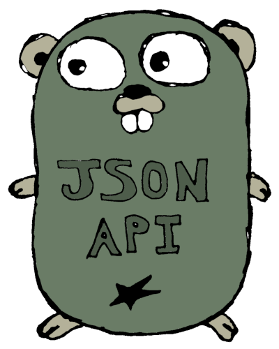

# jsonapi

<div align="center" style="text-align: center;">
  
  <br>
  <a href="https://travis-ci.com/mfcochauxlaberge/jsonapi">
    
  </a>
  <a href="https://goreportcard.com/report/github.com/mfcochauxlaberge/jsonapi">
    
  </a>
  <a href="https://codecov.io/gh/mfcochauxlaberge/jsonapi">
    
  </a>
  <a href="https://godoc.org/github.com/mfcochauxlaberge/jsonapi">
    
  </a>
</div>

jsonapi is a complete library to marshal and unmarshal JSON:API payloads.

It also offers many tools for parsing URLs, handling resources, managing schemas, and building other tools on top of this library.

The official specification can be found at [jsonapi.org/format](http://jsonapi.org/format).

## State

The library is in **alpha** and its API is subject to change until v1 is released. Also, tests are not complete.

## Quick start

The simplest way to start using jsonapi is to use the Marshal and Unmarshal functions.

```
func Marshal(doc *Document, url *URL) ([]byte, error)
func Unmarshal(payload []byte, url *URL, schema *Schema) (*Document, error)
```

A struct has to follow certain rules in order to be understood by the library, but interfaces are also provided which let the library avoid the reflect package and be more efficient.

```
type User struct {
  ID string `json:"id" api:"users"` // ID is mandatory and the api tag sets the type

  // Attributes
  Name string `json:"name" api:"attr"` // attr means it is an attribute
  BornAt time.Time `json:"born-at" api:"attr"`

  // Relationships
  Articles []string `json:"articles" api:"rel,articles"`
}
```

It is recommended to use the json tag which sets the name of the field.

## Attributes

Attributes can be of the following types:

```
string
int, int8, int16, int32, int64
uint, uint8, uint16, uint32
bool
time.Time
*string
*int, *int8, *int16, *int32, *int64
*uint, *uint8, *uint16, *uint32
*bool
*time.Time
```

## Relationships

Relationships can be a bit tricky. To-one relationships are defined with a string and to-many relationships are defined with a slice of strings. They contain the IDs of the related resources. The api tag has to take the form of "rel,xxx[,yyy]" where yyy is optional. xxx is the type of the relationship and yyy is the name of the inverse relationship when dealing with a two-way relationship. In the following example, our Article struct defines a relationship named author of type users:

```
Author string `json:"author" api:"rel,users,articles"`
```

## Documentation

Check out the [incomplete documentation](https://godoc.org/github.com/mfcochauxlaberge/jsonapi).

## Utilities

Some structs and functions are provided to help build tools on top of this library.

For example:

```
// CheckType checks v to make sure it can be used as a type.
func CheckType(v interface{}) error {

// ReflectType reflects on an object and returns the corresponding Type.
func ReflectType(v interface{}) (Type, error)

// IDAndType returns the ID and type of v.
func IDAndType(v interface{}) (string, string)
```

See util.go schema.go, document.go, url.go, and params.go for more.
